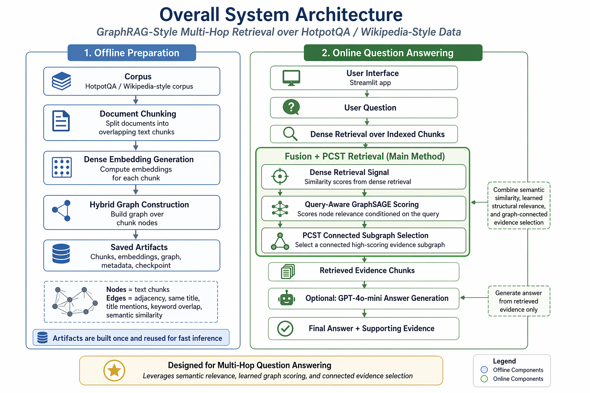

# GraphRAG Multi-Hop Question Answering

## Overview
This repository implements a GraphRAG-style multi-hop question answering system over HotpotQA distractor data and its Wikipedia-style supporting context. The project builds reusable offline artifacts from question-local documents, then serves interactive retrieval and optional answer generation through a Streamlit UI, with a separate FastAPI + React interface also included. The main retrieval pipeline combines dense embedding search, query-aware GraphSAGE node scoring, and PCST-style connected subgraph selection.

## Key Features
- Offline artifact preparation for chunked examples, embeddings, hybrid graphs, manifests, and lookup tables.
- Streamlit application for interactive dataset-mode and custom-question retrieval.
- Optional FastAPI backend and React frontend for a separate web UI.
- Five implemented retrieval modes:
  - `FAISS-only retrieval`
  - `FAISS + heuristic PCST`
  - `GNN retrieval`
  - `Dense retrieval + Query-Aware GraphSAGE`
  - `Dense retrieval + Query-Aware GraphSAGE + PCST (Main Method)`
- Query-aware GraphSAGE training and checkpoint loading for graph-based retrieval modes.
- Custom-question retrieval with exact search and optional ANN backends (`HNSW`, `IVF`) when `hnswlib` or `faiss` is available.
- LLM-based answer evaluation using `gpt-4o-mini`.
- Retrieval and LLM evaluation scripts, including comparison and plotting utilities.

## Architecture

### High-Level View
- Offline preparation:
  - Load HotpotQA distractor examples.
  - Chunk each question’s local context documents.
  - Embed each chunk with a SentenceTransformer model.
  - Build a hybrid graph over chunk nodes.
  - Save reusable artifacts under `artifacts/`.
- Online question answering:
  - Load a prepared artifact bundle.
  - Run one of the retrieval modes on either dataset questions or custom questions.
  - Optionally send retrieved evidence to `gpt-4o-mini` for answer generation.

```text
HotpotQA distractor split
  -> question-local context documents
  -> chunking
  -> dense embeddings
  -> hybrid graph construction
  -> cached artifacts + optional GraphSAGE checkpoint

User question / dataset example
  -> retrieval mode selection
  -> dense / GraphSAGE / fusion / PCST retrieval
  -> retrieved evidence chunks
  -> optional GPT-4o-mini answer generation
  -> answer + supporting evidence in UI/API
```

### Frontend
- `app.py` provides the primary Streamlit experience.
- `frontend/` contains an optional React 18 + Vite + Tailwind frontend that talks to the FastAPI backend.

### Backend
- `backend/api.py` exposes a FastAPI API for profiles, examples, configuration, dataset queries, and custom queries.
- `backend/service.py` contains runtime loading, retrieval orchestration, ANN candidate search, and optional answer generation.

### Database / Storage
- There is no database in the current codebase.
- Persistent state is stored as local artifact files in `artifacts/`:
  - pickled chunked examples
  - pickled graph examples
  - example lookup tables
  - global merged example
  - sample questions
  - manifest JSON
  - GNN checkpoint files

### AI / ML Components
- Dense embeddings: `sentence-transformers`, defaulting to `BAAI/bge-base-en-v1.5`.
- Graph model: Query-aware GraphSAGE implemented with `torch-geometric`.
- Main retrieval method: dense retrieval + query-aware GraphSAGE + PCST.
- Answer generation and LLM evaluation: OpenAI `gpt-4o-mini`.

### External Integrations
- Hugging Face `datasets` for HotpotQA loading.
- OpenAI API for optional answer generation and LLM evaluation.
- Optional ANN libraries:
  - `hnswlib`
  - `faiss`

## Repository Structure
```text
.
├── app.py                              # Streamlit app
├── prepare_artifacts.py                # Offline artifact build script
├── requirements.txt                    # Minimal runtime dependencies for the app/API
├── .env.example                        # Example environment variables
├── backend/
│   ├── api.py                          # FastAPI routes
│   └── service.py                      # Retrieval + answer generation service layer
├── frontend/
│   ├── package.json                    # React/Vite scripts and dependencies
│   └── src/
│       ├── App.tsx                     # Main React UI
│       ├── main.tsx                    # React entrypoint
│       └── styles.css                  # Tailwind-backed styles
├── graphrag_env/
│   ├── requirements.txt                # Broader research/evaluation dependencies
│   └── src/
│       ├── loading.py                  # HotpotQA loading
│       ├── chunking.py                 # Document chunking
│       ├── embeddings.py               # Chunk embedding generation
│       ├── hybrid_graph_builder.py     # Hybrid graph construction
│       ├── gnn_train.py                # Query-aware GraphSAGE training
│       ├── retrieval.py                # Dense retrieval
│       ├── gnn_retrieval.py            # GNN retrieval
│       ├── gnn_fusion_retreival.py     # Dense + GraphSAGE fusion retrieval
│       ├── pcst.py                     # Learned PCST retrieval
│       ├── pcst_dense_retrieval.py     # Dense-guided heuristic PCST retrieval
│       ├── retrieval_eval.py           # Dense retrieval evaluation
│       ├── compare_retrieval_modes.py  # Same-split comparison across all five modes
│       ├── llm_eval.py                 # Answer-generation evaluation
│       ├── plot_llm_eval_results.py    # LLM eval plotting utility
│       ├── artifact_runtime.py         # Artifact and checkpoint loading
│       └── artifact_utils.py           # Artifact pathing and save/load helpers
├── artifacts/                          # Local artifact cache and checkpoints (not for Git)
└── assets/diagrams/
    └── overall-system-architecture-fusion-pcst.png
```

## Tech Stack

### Frontend
- Streamlit
- React 18
- TypeScript
- Vite
- Tailwind CSS

### Backend
- Python
- FastAPI
- Uvicorn

### Database / Storage
- Local filesystem artifacts (`.pkl`, `.json`, `.pt`)

### AI / ML
- `sentence-transformers`
- `torch`
- `torch-geometric`
- `networkx`
- `datasets`
- OpenAI API

### Dev / Evaluation / Visualization
- `tqdm`
- `matplotlib`
- `seaborn`
- `pandas`
- `plotly`

### Optional Retrieval Acceleration
- `hnswlib`
- `faiss-cpu`

## How It Works
1. `loading.py` pulls HotpotQA distractor examples and keeps each question’s local context documents together.
2. `chunking.py` splits each context document into overlapping chunks while preserving question and title metadata.
3. `embeddings.py` embeds each chunk with a SentenceTransformer model and stores per-example embedding matrices.
4. `hybrid_graph_builder.py` builds a local graph for each question with chunk nodes and edges based on:
   - same title
   - adjacent chunk
   - semantic kNN similarity
   - keyword overlap
5. `prepare_artifacts.py` saves chunked examples, graph examples, sample questions, lookup tables, a global merged corpus example, and a manifest under `artifacts/`.
6. `gnn_train.py` converts examples into PyG graphs and trains a query-aware GraphSAGE model to score supporting chunks.
7. At runtime, the app or API loads an artifact bundle and optionally the matching GraphSAGE checkpoint.
8. Retrieval runs in one of five modes, from dense-only to the main GraphSAGE + PCST pipeline.
9. Dataset-mode queries operate on known labeled examples and can compare retrieved titles with gold supporting titles.
10. Custom queries first run dense retrieval over the global chunk pool, optionally through ANN indexes, then apply the selected reranker on the reduced candidate graph.
11. If enabled, the retrieved chunks are packed into a prompt and sent to `gpt-4o-mini` for short answer generation.

## Setup Instructions

### 1. Clone the repository
```bash
git clone https://github.com/DoSomethingGreat07/graphrag-hotpotqa
cd graphrag-hotpotqa
```

### 2. Create and activate a Python environment
```bash
python3 -m venv .venv
source .venv/bin/activate
```

### 3. Install Python dependencies
For the main app/API:
```bash
pip install -r requirements.txt
```

For the broader research/evaluation toolchain under `graphrag_env/`:
```bash
pip install -r graphrag_env/requirements.txt
```

### 4. Configure environment variables
```bash
cp .env.example .env
```

Set the required values:
```env
OPENAI_API_KEY=your_key_here
```

### 5. Prepare artifacts
If you do not already have the `artifacts/` directory, build it locally:
```bash
python3 prepare_artifacts.py --split train --max-samples 10000 --chunk-size 300 --chunk-overlap 50
```

### 6. Train the GraphSAGE checkpoint if needed
Graph-based modes require a trained checkpoint:
```bash
python3 graphrag_env/src/gnn_train.py
```

### 7. Run the app
Primary Streamlit flow:
```bash
streamlit run app.py
```

Optional FastAPI backend:
```bash
uvicorn backend.api:app --reload
```

Optional React frontend:
```bash
cd frontend
npm install
npm run dev
```

## Environment Variables
- `OPENAI_API_KEY`
  - Used by `llm_eval.py`, `backend/service.py`, and the Streamlit app when answer generation is enabled.
  - Required only for OpenAI-backed answer generation and LLM evaluation.

## Running the Project

### Development
- Streamlit app:
  ```bash
  streamlit run app.py
  ```
- FastAPI backend:
  ```bash
  uvicorn backend.api:app --reload
  ```
- React frontend:
  ```bash
  cd frontend
  npm run dev
  ```

### Frontend build
```bash
cd frontend
npm run build
npm run preview
```

### Retrieval evaluation
- Dense:
  ```bash
  python3 -m graphrag_env.src.retrieval_eval --max-samples 10000 --top-k 5
  ```
- Dense-guided heuristic PCST:
  ```bash
  python3 -m graphrag_env.src.pcst_dense_retrieval --max-samples 10000 --top-k 5
  ```
- GNN:
  ```bash
  python3 -m graphrag_env.src.gnn_retrieval --max-samples 10000 --top-k 5
  ```
- Fusion:
  ```bash
  python3 -m graphrag_env.src.gnn_fusion_retreival --max-samples 10000 --top-k 5 --lambda-dense 0.5
  ```
- Main method:
  ```bash
  python3 -m graphrag_env.src.pcst --max-samples 10000 --top-k 5 --seed-k 5 --expansion-factor 5 --fusion-anchor-pool-factor 3 --pcst-bonus 0.08 --preserve-fusion-top-k 2 --title-diversity-bonus 0.03 --lambda-dense 0.5
  ```
- Same-split comparison across all five modes:
  ```bash
  python3 -m graphrag_env.src.compare_retrieval_modes --max-samples 10000 --top-k 5
  ```

### LLM evaluation
```bash
python3 -m graphrag_env.src.llm_eval --retrieval-mode dense --max-samples 300 --top-k 5
python3 -m graphrag_env.src.llm_eval --retrieval-mode pcst_dense --max-samples 300 --top-k 5
python3 -m graphrag_env.src.llm_eval --retrieval-mode gnn --max-samples 300 --top-k 5
python3 -m graphrag_env.src.llm_eval --retrieval-mode fusion --max-samples 300 --top-k 5
python3 -m graphrag_env.src.llm_eval --retrieval-mode pcst --max-samples 300 --top-k 5
```

### Plot LLM evaluation results
```bash
python3 -m graphrag_env.src.plot_llm_eval_results --files llm_eval_results_dense.json llm_eval_results_pcst_dense.json llm_eval_results_gnn.json llm_eval_results_fusion.json llm_eval_results_pcst.json --output assets/diagrams/llm_eval_mode_comparison.png --summary-csv assets/diagrams/llm_eval_mode_summary.csv
```

## API Endpoints
Based on `backend/api.py`:

### `GET /api/health`
Returns a simple health check.

### `GET /api/profiles`
Lists available artifact profiles discovered from manifest files in `artifacts/`.

### `GET /api/config?profile_id=<id>`
Returns runtime metadata for a selected artifact profile, including manifest info, sample questions, available custom backends, and whether a GNN checkpoint exists.

### `GET /api/examples?profile_id=<id>&question_type=<type>`
Returns dataset examples for the selected profile. `question_type` defaults to `all`.

### `POST /api/query/dataset`
Runs retrieval against a labeled dataset example.

Request body fields:
- `profile_id`
- `example_id`
- `retrieval_mode`
- `top_k`
- `lambda_dense`
- `llm_enabled`
- `compare_all_modes`

### `POST /api/query/custom`
Runs retrieval against a free-form custom question.

Request body fields:
- `profile_id`
- `question`
- `retrieval_mode`
- `top_k`
- `lambda_dense`
- `llm_enabled`
- `compare_all_modes`
- `custom_backend`

## Database / Schema
No database schema or ORM models are present in the current repository.

The closest thing to a persisted schema is the artifact layout defined in `artifact_utils.py`:
- `<tag>_manifest.json`
- `<tag>_chunked_examples.pkl`
- `<tag>_graph_examples.pkl`
- `<tag>_example_lookup.pkl`
- `<tag>_global_example.pkl`
- `<tag>_sample_questions.json`
- `<tag>_query_aware_graphsage_best.pt`

## Agent / AI Workflow

### Retrieval modules
- `retrieval.py`
  - Dense retrieval over precomputed chunk embeddings.
- `gnn_retrieval.py`
  - Graph-only ranking with QueryAwareGraphSAGE.
- `gnn_fusion_retreival.py`
  - Blends normalized dense similarity and GraphSAGE scores.
- `pcst_dense_retrieval.py`
  - Runs heuristic PCST using dense scores as node prizes.
- `pcst.py`
  - Main method: dense + GraphSAGE fusion scores, then graph-aware PCST-style selection.

### Training module
- `gnn_train.py`
  - Builds PyG graphs where each node feature includes:
    - chunk embedding
    - repeated query embedding
    - dense similarity to the query
  - Trains a binary supporting-chunk classifier with GraphSAGE.

### Evaluation modules
- `retrieval_eval.py`
  - Dense retrieval metrics.
- `compare_retrieval_modes.py`
  - Same validation split comparison across all five retrieval modes.
- `llm_eval.py`
  - End-to-end answer EM/F1 evaluation using OpenAI.
- `plot_llm_eval_results.py`
  - Generates comparison charts and a summary CSV from saved `llm_eval` outputs.

### Answer generation
- Both the Streamlit app and FastAPI backend use `gpt-4o-mini` with a constrained JSON output format.
- The prompt instructs the model to answer using only retrieved evidence and to return a short final answer.

## Screenshots / Demo
Architecture diagram:



<!-- Add screenshots or demo GIFs here -->

## Deployment
Based on the current codebase, the project appears designed for local or self-managed deployment rather than a specific managed platform.

What exists:
- Streamlit app entrypoint: `app.py`
- FastAPI backend: `backend/api.py`
- React frontend build scripts in `frontend/package.json`

What does not exist:
- No `Dockerfile`
- No `docker-compose.yml`
- No Vercel, Netlify, or cloud deployment config
- No CI/CD workflow for builds or deployment

For a reproducible deployment, you will need:
- a Python environment with the required dependencies
- the prepared `artifacts/` directory
- an OpenAI API key if answer generation is enabled
- a trained GraphSAGE checkpoint if graph-based modes are required

## Limitations / Future Improvements
- The repository depends on local artifact files; without them, startup requires rebuilding from the HotpotQA dataset.
- Graph-based modes depend on a checkpoint matching the selected artifact profile.
- The React frontend hardcodes the API base to `http://127.0.0.1:8000/api`.
- ANN acceleration is optional and depends on extra libraries not installed by the main `requirements.txt`.
- There is no automated test suite in the current repository.
- There is no containerized deployment configuration.
- Some evaluation outputs and legacy scripts remain in `graphrag_env/src/`, so a public-facing cleanup pass may still be useful before publishing.

## Contributing
Contributions are easiest when they preserve the current separation of concerns:
- offline artifact generation and training in `graphrag_env/src/`
- runtime app logic in `app.py`
- API orchestration in `backend/`
- optional web UI in `frontend/`

If you add new retrieval modes or artifact fields, update both the runtime apps and the evaluation scripts so the repo stays internally consistent.

## License
No license specified in the repository.
